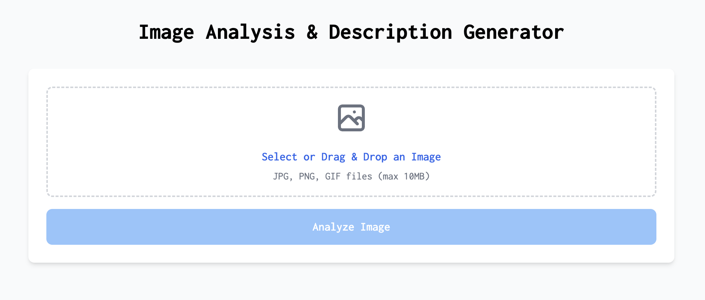

# VisionSHOP

VisionSHOP is an AI-powered image analysis and product description generator for e-commerce platforms. This application allows users to upload images, analyzes them using Google Cloud Vision API, and generates comprehensive product descriptions using Openai GPT.



## Features

- 📷 Simple drag-and-drop image upload interface
- 🔍 Advanced image analysis using Google Cloud Vision API
- ✍️ AI-generated product descriptions optimized for e-commerce
- 🌐 Multi-language support (descriptions in Uzbek)
- 📋 Easy copy-to-clipboard functionality
- 📱 Responsive design for all devices

## Tech Stack

### Frontend

- React 18+ with TypeScript
- Vite for fast development and building
- Tailwind CSS for responsive styling
- Axios for API requests

### Backend

- Express.js with TypeScript
- Google Cloud Vision API for image analysis
- Anthropic Openai API for intelligent product descriptions
- File upload handling with Express FileUpload

## Getting Started

### Prerequisites

- Node.js (v14.0.0 or higher)
- Google Cloud account with Vision API enabled
- Anthropic API key

### Installation

1. Clone the repository:

```bash
git clone https://github.com/yourusername/vision-shop.git
cd vision-shop
```

2. Install dependencies for backend:

```bash
cd server
npm install
```

3. Create a `.env` file in the server directory with the following variables:

```
PORT=5000
GOOGLE_APPLICATION_CREDENTIALS=
OPENAI_API_KEY=
```

4. Place your Google Cloud credentials JSON file in the server directory.

5. Install dependencies for frontend:

```bash
cd ../client
npm install
```

### Running the Application

#### Development Mode

1. Start the backend server:

```bash
cd server
npm run dev
```

2. In a new terminal, start the frontend development server:

```bash
cd client
npm run dev
```

3. Open your browser and navigate to `http://localhost:5173`

#### Production Mode

1. Build the frontend:

```bash
cd client
npm run build
```

2. Build the backend:

```bash
cd ../server
npm run build
```

3. Start the production server:

```bash
npm start
```

## How It Works

1. **Upload Image**: User uploads an image through the interface.
2. **Image Analysis**: The image is sent to Google Cloud Vision API, which returns labels and annotations.
3. **Description Generation**: The labels are processed by Anthropic Openai API to generate SEO-friendly product descriptions.
4. **Result Display**: The user receives both the raw analysis and the formatted description, ready to use for e-commerce.

## Project Structure

```
vision-shop/
├── client/                 # Frontend application
│   ├── src/
│   │   ├── components/
│   │   ├── App.tsx
│   │   └── ...
│   └── ...
├── server/                 # Backend API
│   ├── src/
│   │   ├── controllers/
│   │   ├── routes/
│   │   ├── services/
│   │   └── ...
│   └── ...
└── README.md
```

## API Endpoints

- `POST /api/images/process`: Process uploaded image and generate description

## Customization

### Changing the AI Prompt

To modify how descriptions are generated, edit the prompt in `server/src/services/openaiService.ts`.

### Adjusting Vision API Parameters

To change what types of analysis are performed on images, modify the Vision API settings in `server/src/services/visionService.ts`.

## Future Enhancements

- Support for multiple languages
- Batch processing for multiple images
- Custom templates for different product categories
- Integration with e-commerce platforms (Shopify, WooCommerce, etc.)
- Image enhancement features

## License

This project is licensed under the MIT License - see the LICENSE file for details.

## Acknowledgments

- Google Cloud Vision API for image analysis capabilities
- Anthropic for the Claude AI API
- All contributors to this project

---

For questions or support, please open an issue on the GitHub repository.
